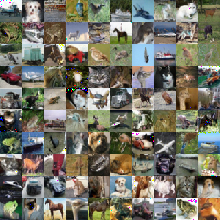

# Flow Matching for Generative Modeling

A minimal PyTorch implementation of [Flow Matching for Generative Modeling](https://arxiv.org/abs/2210.02747).

This repository implements conditional flow matching with optimal transport probability paths using a U-Net architecture.

Here are some images generated by the model trained on CIFAR-10 for 400K steps:      



A helpful reference for my theoretical understanding was the paper [Flow Matching Guide and Code](https://arxiv.org/abs/2412.06264).

---

#### Dependencies

- `pytorch`
- [`einops`](https://einops.rocks/)
- [`torchdiffeq`](https://github.com/rtqichen/torchdiffeq)

---

## References

```bibtex
@misc{lipman2023flowmatchinggenerativemodeling,
      title={Flow Matching for Generative Modeling}, 
      author={Yaron Lipman and Ricky T. Q. Chen and Heli Ben-Hamu and Maximilian Nickel and Matt Le},
      year={2023},
      eprint={2210.02747},
      archivePrefix={arXiv},
      primaryClass={cs.LG},
      url={https://arxiv.org/abs/2210.02747}, 
}
```

```bibtex
@misc{lipman2024flowmatchingguidecode,
      title={Flow Matching Guide and Code}, 
      author={Yaron Lipman and Marton Havasi and Peter Holderrieth and Neta Shaul and Matt Le and Brian Karrer and Ricky T. Q. Chen and David Lopez-Paz and Heli Ben-Hamu and Itai Gat},
      year={2024},
      eprint={2412.06264},
      archivePrefix={arXiv},
      primaryClass={cs.LG},
      url={https://arxiv.org/abs/2412.06264}, 
}
```
```bibtext
@misc{torchdiffeq,
	author={Chen, Ricky T. Q.},
	title={torchdiffeq},
	year={2018},
	url={https://github.com/rtqichen/torchdiffeq},
}
```